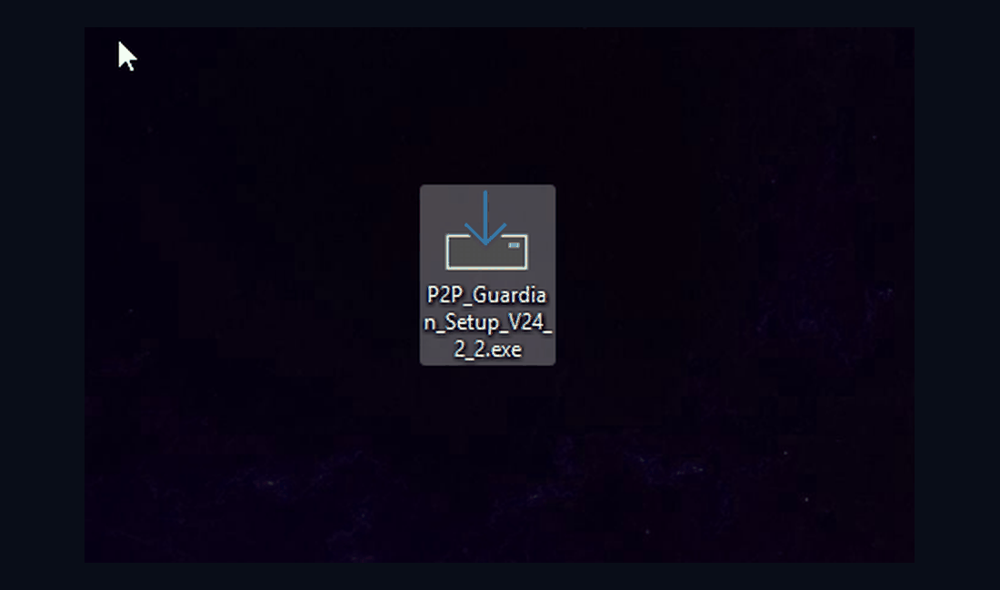

# P2P Guardian

<p align="center">
  
</p>

P2P Guardian is a Windows-based OSRS Discord Monitor designed to send monitoring alerts, screenshots, task notifications, and level-up notifications to Discord.

## Current Release

**V24.2.5**

[Download the latest release](../../releases/latest)

## Features

- Discord monitoring notifications
- Account and client/PID status monitoring
- OSRS task monitoring
- Task notification channel support
- Level-up notification channel support
- Startup screenshot check-ins
- Periodic screenshot check-ins
- Manual screenshots through Discord
- Windows Graphics Capture (WGC) screenshot support
- Screenshot support when the OSRS client is minimized
- P2P Guardian Control for starting and stopping the bot
- Automatic Windows startup
- Guided first-time Discord bot setup
- Automatic Python dependency checking
- Automatic update notifications
- Existing installation update support
- Support and bug-reporting tools

## What's New in V24.2.5

- Updated P2P Guardian to V24.2.5
- Improved Windows Graphics Capture (WGC) screenshot support
- Screenshot capture works with minimized OSRS clients
- Added `windows-capture==2.0.1`
- Improved Python dependency checking
- Dependencies are checked before installation
- Only missing or incorrect dependencies need to be installed
- Improved installer version detection
- Improved new-installation and update handling
- Existing Discord configuration is preserved during updates
- Updated P2P Guardian Control version handling
- Improved GitHub release update checking
- Updated installer and public release structure
- Updated support and diagnostic tools

## Requirements

> **Note:** When using the P2P Guardian `.exe`, the required Python dependencies are checked automatically. Missing or incorrect dependencies are installed when required.

- Windows
- OSRS running on the Windows desktop
- Tesseract OCR installed
- A Discord bot created through the Discord Developer Portal
- Your Discord bot token
- The required Discord channel IDs
- Your Discord user ID

### Python Dependencies

```text
discord.py
Pillow
psutil
pytesseract
opencv-python
numpy
windows-capture==2.0.1
```

## Discord Bot Setup

Create a Discord application and bot through the Discord Developer Portal.

The bot requires these OAuth2 scopes:

- `bot`
- `applications.commands`

The bot requires these permissions:

- View Channels
- Send Messages
- Embed Links
- Attach Files

Administrator permission is **not required**.

## Installation

For a first-time installation, the P2P Guardian installer guides you through the required Discord bot configuration.

The installer checks the existing Windows installation and determines whether the setup is a new installation or an update.

You will need to provide your own local:

- Discord bot token
- Discord channel IDs
- Discord user ID

Python dependencies are checked automatically during setup. If the required dependencies are already installed with the correct versions, they do not need to be installed again.

For an existing installation, updates preserve the existing local Discord token and Discord settings.

## Screenshots

P2P Guardian uses Windows Graphics Capture (WGC) for client screenshot capture.

Screenshots can be requested through Discord and are captured from the selected OSRS client rather than the entire desktop.

WGC also supports screenshot capture when the OSRS client is minimized.

Screenshot events can be identified as:

- Manual
- Startup
- Automatic

The screenshot system is designed to capture only the selected OSRS client.

## P2P Guardian Control

P2P Guardian Control is used to manage the P2P Guardian monitor.

It can be used to:

- Start the monitor
- Stop the monitor
- Manage the local P2P Guardian process
- Check for newer official releases
- Start an available update

Updates are provided through the official GitHub Releases system.

Existing local Discord configuration is preserved during updates.

## Source Code

The repository contains the public source code used by P2P Guardian.

- [`src`](./src) — OSRS Discord Monitor source files
- [`installer`](./installer) — Inno Setup installer source and build information
- [`assets`](./assets) — Public project assets

The repository does not contain private Discord credentials or other private configuration.

## Security

Never publish or commit your private Discord credentials.

The public repository does **not** contain:

- Discord bot tokens
- Personal Discord user IDs
- Private Discord channel IDs
- API keys
- Passwords
- Webhooks

Do not commit local configuration files such as:

```text
discord_token.txt
osrs_bot_config.json
```

Keep your Discord bot token private.

## Updates

Official P2P Guardian releases are published through the GitHub Releases page.

P2P Guardian Control can check for a newer official release and notify the user when an update is available.

Updates are designed to preserve the existing local Discord configuration.

Always obtain release files from the official P2P Guardian repository.

## Support

Use the included support and bug-reporting tools when reporting problems.

When reporting an issue, provide relevant logs and details about the problem.

Never include your Discord bot token or other private credentials in a support request.

## Disclaimer

P2P Guardian is provided as-is.

You are responsible for how you use this software.

The developer is not responsible for OSRS or Discord bans, account restrictions, data loss, system damage, or other direct or indirect consequences resulting from its use.

**USE AT YOUR OWN RISK.**

## License

See the repository for the applicable project terms.

Support packages must not contain the Discord bot token or other private credentials.

---

Developed by **Bas | Razor**
